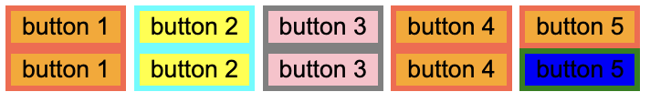

organized `frequently used CSS` and what I get `confused` the most

### ✅ justify-content

> to arrange itmes in **axis**

- center
- space-between  
  first item is flush with the start, last item with the end

### ✅ align-itmes

> to arrange itmes in **cross-axis**

### ✅ flex-direction

> to change the order of flex

- row
- column
- row-reverse
- column-reverse

### ✅ position

> when **NOT** flex

- static: 기본 옵션  
  `top` `right`, `left`, `right` 등의 옵션을 줄 수 있음 ❌
- relative  
  `top` `right`, `left`, `right` 등의 옵션을 줄 수 있음 ⭕️
- absolute  
  `position: relative`를 가진 item을 기준으로 배치  
  `top: 10px` 주면 `position: relative`를 가진 item을 기준으로 `top: 10px` 띄어서 배치  
  `top` `right`, `left`, `right` 등의 옵션을 줄 수 있음 ⭕️
- fixed  
  보여지는 화면 기준으로 배치
  스크롤을 내려도 게속 그 자리에 있음  
  `top` `right`, `left`, `right` 등의 옵션을 줄 수 있음 ⭕️
- sticky

### ✅ selector

```html
<div class="column_0">
  <button id="btn_1">button 1</button>
  <button id="btn_2">button 2</button>
  <button id="btn_3">button 3</button>
  <button id="btn_4">button 4</button>
  <button id="btn_5">button 5</button>
</div>

<div class="column_1">
  <button id="btn_1">button 1</button>
  <button id="btn_2">button 2</button>
  <button id="btn_3">button 3</button>
  <button id="btn_4">button 4</button>
  <button id="btn_5">button 5</button>
</div>
```

```css
button {
  background-color: orange;
  border: 3px tomato solid;
}
#btn_3 {
  background-color: pink;
  border: 3px gray solid;
}
button:nth-child(2) {
  background-color: yellow;
  border: 3px aqua solid;
}

.column_1 > button:last-child {
  background-color: blue;
  border: 3px green solid;
}
```

**result**



### ✅ Pseudo-classes

> specify a special state of the selected element such as `:hover`, `:active`(눌렸을 때)

```css
#btn_1:hover {
  background-color: pink;
  border: 3px tomato solid;
}
```
